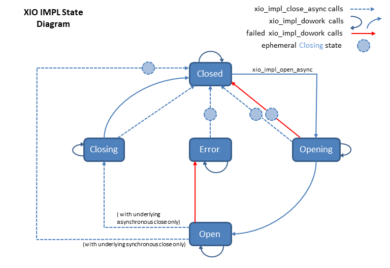

# xio_impl

## Overview

This specification defines the `xio_impl` component, which provides state management and callback handling
for `xio` components. It works in conjunction with an `xio_endpoint` component that implements
outgoing `xio` commmunication, plus an `xio_endpoint_config` component that implements configuration
and option handling.

## References

[xio.h](/inc/azure_c_shared_utility/xio.h)</br>
[xio_endpoint.h](/inc/azure_c_shared_utility/xio_endpoint.h)</br>
[xio_endpoint_config.h](/inc/azure_c_shared_utility/xio_endpoint_config.h)</br>


## Exposed API

The `xio_impl` implements and export all the functions defined in `xio_impl.h`. 
```c
CONCRETE_IO_HANDLE xio_impl_create(const XIO_ENDPOINT_INTERFACE* endpoint_interface, XIO_ENDPOINT_CONFIG_INTERFACE* xio_endpoint_config_interface, XIO_ENDPOINT_CONFIG_HANDLE xio_endpoint_config_instance);
    
// These functions replace the corresponding functions in your 
// specific xio_get_interface_description
void xio_impl_destroy(CONCRETE_IO_HANDLE, xio);
int xio_impl_open_async(CONCRETE_IO_HANDLE xio, ON_IO_OPEN_COMPLETE on_open_complete, void* on_open_complete_context ON_BYTES_RECEIVED, on_bytes_received, void*, on_bytes_received_context, ON_IO_ERROR on_io_error, void* on_io_error_context);
Mint xio_impl_close_async(CONCRETE_IO_HANDLE xio, ON_IO_CLOSE_COMPLETE on_close_complete, void* callback_context);
int xio_impl_send_async(CONCRETE_IO_HANDLE xio, const void* buffer, size_t size, ON_SEND_COMPLETE on_send_complete, void* callback_context);
void xio_impl_dowork(CONCRETE_IO_HANDLE xio);
int xio_impl_setoption(CONCRETE_IO_HANDLE xio, const char* optionName, const void* value);
OPTIONHANDLER_HANDLE xio_impl_retrieveoptions(CONCRETE_IO_HANDLE xio);

```
**]**

The following types from `xio.h` are also referenced in individual requirements.
```c

typedef enum IO_OPEN_RESULT_TAG
{
    IO_OPEN_OK,
    IO_OPEN_ERROR,
    IO_OPEN_CANCELLED
} IO_OPEN_RESULT;

typedef enum IO_SEND_RESULT_TAG
{
    IO_SEND_OK,
    IO_SEND_ERROR,
    IO_SEND_CANCELLED
} IO_SEND_RESULT;

typedef void(*ON_BYTES_RECEIVED)(void* context, const unsigned char* buffer, size_t size);
typedef void(*ON_SEND_COMPLETE)(void* context, IO_SEND_RESULT send_result);
typedef void(*ON_IO_OPEN_COMPLETE)(void* context, IO_OPEN_RESULT open_result);
typedef void(*ON_IO_CLOSE_COMPLETE)(void* context);
typedef void(*ON_IO_ERROR)(void* context);

typedef struct TLSIO_CONFIG_TAG
{
    const char* hostname;
    int port;
    const IO_INTERFACE_DESCRIPTION* underlying_io_interface;
    void* underlying_io_parameters;
} TLSIO_CONFIG;
```

## External State
The external state of the `xio_impl` component is determined by which of the component's interface 
functions have been called and which callbacks have been performed. The components's internal state
is not observable from outside, but maps 1:1 to the external state. The external states are defined as follows:

* XIO_IMPL_STATE_EXT_CLOSED means either that the module is newly constructed by `xio_impl_create`, that the `xio_impl_close_async` complete callback has been received, or that the `on_open_complete` callback has returned with `IO_OPEN_ERROR`.
* XIO_IMPL_STATE_EXT_OPENING means that the `xio_impl_open_async` call has completed successfully but the `on_open_complete` callback has not been performed.
* XIO_IMPL_STATE_EXT_OPEN means that the `on_open_complete` callback has returned with `IO_OPEN_OK`.
* XIO_IMPL_STATE_EXT_CLOSING means that either the `xio_impl_close_async` call has completed successfully but the `on_close_complete` callback has not yet been performed, or that  the `on_open_complete` callback has returned with `IO_OPEN_CANCELLED`.
* XIO_IMPL_STATE_EXT_ERROR means that `on_io_error` has been called from `xio_impl_dowork`.

## State Transitions
This list shows the effect of the calls as a function of state with happy internal functionality. Unhappy functionality is not shown. The `xio_impl_setoption` and `xio_impl_retrieveoptions` calls are not shown because they have no effect on state and are always allowed. Calls to `xio_impl_send_async` also do not affect state, and are allowed only during XIO_IMPL_STATE_EXT_OPEN.

All transitions into XIO_IMPL_STATE_EXT_CLOSED are understood to pass through XIO_IMPL_STATE_EXT_CLOSING.


<table>
  <tr>From state <b>XIO_IMPL_STATE_EXT_CLOSED</b></tr>
  <tr>
    <td>xio_impl_destroy</td>
    <td>ok (destroyed)</td>
  </tr>
  <tr>
    <td>xio_impl_open_async</td>
    <td>ok, enter XIO_IMPL_STATE_EXT_OPENING</td>
  </tr>
  <tr>
    <td>xio_impl_close_async</td>
    <td>ok, remain in XIO_IMPL_STATE_EXT_CLOSED</td>
  </tr>
  <tr>
    <td>xio_impl_dowork</td>
    <td>ok (does nothing), remain in XIO_IMPL_STATE_EXT_CLOSED</td>
  </tr>
</table>

<table>
  <tr>From state <b>XIO_IMPL_STATE_EXT_OPENING</b></tr>
  <tr>
    <td>xio_impl_destroy</td>
    <td>log error, force immediate close, destroy (destroyed)</td>
  </tr>
  <tr>
    <td>xio_impl_open_async</td>
    <td>fail, log error, remain in XIO_IMPL_STATE_EXT_OPENING (usage error)</td>
  </tr>
  <tr>
    <td>xio_impl_close_async</td>
    <td>ok, force immediate close, enter XIO_IMPL_STATE_EXT_CLOSED</td>
  </tr>
  <tr>
    <td>xio_impl_dowork</td>
    <td>ok (continue opening), remain in XIO_IMPL_STATE_EXT_OPENING or enter XIO_IMPL_STATE_EXT_OPEN</td>
  </tr>
</table>

<table>
  <tr>From state <b>XIO_IMPL_STATE_EXT_OPEN</b></tr>
  <tr>
    <td>xio_impl_destroy</td>
    <td>(a possible normal SDK behavior) force immediate close, destroy (destroyed)</td>
  </tr>
  <tr>
    <td>xio_impl_open_async</td>
    <td>fail, log error, remain in XIO_IMPL_STATE_EXT_OPEN (usage error)</td>
  </tr>
  <tr>
    <td>xio_impl_close_async</td>
    <td>adapters with internal async close: ok, enter XIO_IMPL_STATE_EXT_CLOSING<br/>adatpers without internal async close: ok, enter XIO_IMPL_STATE_EXT_CLOSING, then  <br/>immediately enter XIO_IMPL_STATE_EXT_CLOSED</td>
  </tr>
  <tr>
    <td>xio_impl_dowork</td>
    <td>ok (send and receive as necessary), remain in XIO_IMPL_STATE_EXT_OPEN</td>
  </tr>
</table>

<table>
  <tr>From state <b>XIO_IMPL_STATE_EXT_CLOSING</b></tr>
  <tr>
    <td>xio_impl_destroy</td>
    <td>log error, force immediate close, destroy (destroyed)</td>
  </tr>
  <tr>
    <td>xio_impl_open_async</td>
    <td>fail, log error, remain in XIO_IMPL_STATE_EXT_CLOSING (usage error)</td>
  </tr>
  <tr>
    <td>xio_impl_close_async</td>
    <td>ok, force immediate close, enter XIO_IMPL_STATE_EXT_CLOSED</td>
  </tr>
  <tr>
    <td>xio_impl_dowork</td>
    <td>ok (continue graceful closing) , remain in XIO_IMPL_STATE_EXT_CLOSING or <br/>enter XIO_IMPL_STATE_EXT_CLOSED</td>
  </tr>
</table>

<table>
  <tr>From state <b>XIO_IMPL_STATE_EXT_ERROR</b></tr>
  <tr>
    <td>xio_impl_destroy</td>
    <td>log error, force immediate close, destroy (destroyed)</td>
  </tr>
  <tr>
    <td>xio_impl_open_async</td>
    <td>fail, log error, remain in XIO_IMPL_STATE_EXT_ERROR (usage error)</td>
  </tr>
  <tr>
    <td>xio_impl_close_async</td>
    <td>ok, force immediate close, enter XIO_IMPL_STATE_EXT_CLOSED</td>
  </tr>
  <tr>
    <td>xio_impl_dowork</td>
    <td>ok (does nothing), remain in XIO_IMPL_STATE_EXT_ERROR</td>
  </tr>
</table>



## Definitions 

#### Explicit state transitions

Throughout this document, state transitions only occur as explicitly specified. If no state transition is called out, then none is allowed. (So "do nothing" is always understood as the default.)

#### Specified state transitions

Requirements in this document use the phrase "shall enter XIO_IMPL_STATE_EXT_XXXX" to specify behavior. Here are the definitions of the state transition phrases:

##### "enter XIO_IMPL_STATE_EXT_ERROR"
**SRS_XIO_IMPL_30_005: [** The phrase "enter XIO_IMPL_STATE_EXT_ERROR" means the adapter shall call the `on_io_error` function and pass the `on_io_error_context` that was supplied in `xio_impl_open_async`. **]**

##### "enter XIO_IMPL_STATE_EXT_CLOSING"
**SRS_XIO_IMPL_30_009: [** The phrase "enter XIO_IMPL_STATE_EXT_CLOSING" means the adapter shall iterate through any unsent messages in the queue and shall delete each message after calling its `on_send_complete` with the associated `callback_context` and `IO_SEND_CANCELLED`. **]**

##### "enter XIO_IMPL_STATE_EXT_CLOSED"
**SRS_XIO_IMPL_30_006: [** The phrase "enter XIO_IMPL_STATE_EXT_CLOSED" means the adapter shall forcibly close any existing connections then call the `on_close_complete` function and pass the `on_close_complete_context` that was supplied in `xio_impl_close_async`. **]**

##### "enter XIO_IMPL_STATE_EXT_OPENING"
The phrase "enter XIO_IMPL_STATE_EXT_OPENING" means the adapter will continute the process of opening the TSL connection to the host on the next `xio_impl_dowork` call, but no other externally visible action is being specified.

##### "enter XIO_IMPL_STATE_EXT_OPEN"
**SRS_XIO_IMPL_30_007: [** The phrase "enter XIO_IMPL_STATE_EXT_OPEN" means the adapter shall call the `on_open_complete` function and pass IO_OPEN_OK and the `on_open_complete_context` that was supplied in `xio_impl_open_async`. **]**

##### "destroy the failed message"
**SRS_XIO_IMPL_30_002: [** The phrase "destroy the failed message" means that the adapter shall remove the message from the queue and destroy it after calling the message's `on_send_complete` along with its associated `callback_context` and `IO_SEND_ERROR`. **]**


## API Calls


###   xio_impl_create
A specialized create function, `xio_impl_create` is not used directly in interface descriptions.
```c
CONCRETE_IO_HANDLE xio_impl_create(const XIO_ENDPOINT_INTERFACE* endpoint_interface, 
    XIO_ENDPOINT_CONFIG_INTERFACE* xio_endpoint_config_interface, 
    XIO_ENDPOINT_CONFIG_HANDLE xio_endpoint_config_instance);
```


**SRS_XIO_IMPL_30_010: [** The `xio_impl_create` shall allocate and initialize all necessary resources and return an instance of the `xio_impl` in XIO_IMPL_STATE_EXT_CLOSED. **]**

**SRS_XIO_IMPL_30_011: [** If any resource allocation fails, `xio_impl_create` shall return NULL. **]**

**SRS_XIO_IMPL_30_013: [** If any of the input parameters is NULL, `xio_impl_create` shall log an error and return NULL. **]**


###   xio_impl_destroy
Implementation of `concrete_io_destroy`
```c
void xio_impl_destroy(CONCRETE_IO_HANDLE xio_impl_handle);
```

**SRS_XIO_IMPL_30_020: [** If `xio_impl_handle` is NULL, `xio_impl_destroy` shall do nothing. **]**

**SRS_XIO_IMPL_30_021: [** The `xio_impl_destroy` shall release all allocated resources and then release `xio_impl_handle`. **]**

**SRS_XIO_IMPL_30_022: [** If the adapter is in any state other than XIO_IMPL_STATE_EXT_CLOSED when `xio_impl_destroy` is called, the adapter shall [enter XIO_IMPL_STATE_EXT_CLOSING](#enter-XIO_IMPL_STATE_EXT_CLOSING "Iterate through any unsent messages in the queue and delete each message after calling its `on_send_complete` with the associated `callback_context` and `IO_SEND_CANCELLED`.") and then [enter XIO_IMPL_STATE_EXT_CLOSED](#enter-XIO_IMPL_STATE_EXT_CLOSED "Forcibly close any existing connections then call the `on_close_complete` function and pass the `on_close_complete_context` that was supplied in `xio_impl_close_async`.") before completing the destroy process. **]**


###   xio_impl_open_async
Implementation of `concrete_io_open`

```c
int xio_impl_open_async(
    CONCRETE_IO_HANDLE xio_impl_handle,
    ON_IO_OPEN_COMPLETE on_open_complete,
    void* on_open_complete_context,
    ON_BYTES_RECEIVED on_bytes_received,
    void* on_bytes_received_context,
    ON_IO_ERROR on_io_error,
    void* on_io_error_context);
```

**SRS_XIO_IMPL_30_030: [** If any of the `xio_impl_handle`, `on_open_complete`, `on_bytes_received`, or `on_io_error` parameters is NULL, `xio_impl_open_async` shall log an error and return `_FAILURE_`. **]**

**SRS_XIO_IMPL_30_037: [** If the adapter is in any state other than XIO_IMPL_STATE_EXT_CLOSED when `xio_impl_open_async` is called, it shall log an error, and return `_FAILURE_`. **]**

**SRS_XIO_IMPL_30_038: [** If `xio_impl_open_async` fails to  [enter XIO_IMPL_STATE_EXT_OPENING](#enter-XIO_IMPL_STATE_EXT_OPENING "Continute the process of opening the TSL connection to the host on the next `xio_impl_dowork` call") it shall return `_FAILURE_`. **]**

**SRS_XIO_IMPL_30_039: [** On failure, `xio_impl_open_async` shall not call `on_open_complete`. **]**

**SRS_XIO_IMPL_30_034: [** On success, `xio_impl_open_async` shall store the provided `on_bytes_received`,  `on_bytes_received_context`, `on_io_error`, `on_io_error_context`, `on_open_complete`,  and `on_open_complete_context` parameters for later use as specified and tested per other line entries in this document. **]**

**SRS_XIO_IMPL_30_035: [** On success, `xio_impl_open_async` shall cause the adapter to [enter XIO_IMPL_STATE_EXT_OPENING](#enter-XIO_IMPL_STATE_EXT_OPENING "Continute the process of opening the TSL connection to the host on the next `xio_impl_dowork` call") and return 0. **]**


###   xio_impl_close_async
Implementation of `concrete_io_close`
```c
int xio_impl_close_async(CONCRETE_IO_HANDLE xio_impl_handle, 
    ON_IO_CLOSE_COMPLETE on_close_complete, void* callback_context);
```

**SRS_XIO_IMPL_30_050: [** If the `xio_impl_handle` or `on_close_complete` parameter is NULL, `xio_impl_close_async` shall log an error and return `_FAILURE_`. **]**

**SRS_XIO_IMPL_30_054: [** On failure, the adapter shall not call `on_close_complete`. **]**

**SRS_XIO_IMPL_30_053: [** If the adapter is in any state other than XIO_IMPL_STATE_EXT_OPEN or XIO_IMPL_STATE_EXT_ERROR then `xio_impl_close_async` shall log that `xio_impl_close_async` has been called and then continue normally. **]**

**SRS_XIO_IMPL_30_057: [** On success, if the adapter is in XIO_IMPL_STATE_EXT_OPENING, it shall call `on_open_complete` with the `on_open_complete_context` supplied in `xio_impl_open_async` and `IO_OPEN_CANCELLED`. This callback shall be made before changing the internal state of the adapter. **]**

**SRS_XIO_IMPL_30_056: [** On success the adapter shall [enter XIO_IMPL_STATE_EXT_CLOSING](#enter-XIO_IMPL_STATE_EXT_CLOSING "Iterate through any unsent messages in the queue and delete each message after calling its `on_send_complete` with the associated `callback_context` and `IO_SEND_CANCELLED`."). **]**

**SRS_XIO_IMPL_30_051: [** On success, if the underlying connection does not support asynchronous closing or if the adapter is not in XIO_IMPL_STATE_EXT_OPEN, then the adapter shall [enter XIO_IMPL_STATE_EXT_CLOSED](#enter-XIO_IMPL_STATE_EXT_CLOSED "Forcibly close any existing connections then call the `on_close_complete` function and pass the `on_close_complete_context` that was supplied in `xio_impl_close_async`.") immediately after entering XIO_IMPL_STATE_EXT_CLOSING. **]**

**SRS_XIO_IMPL_30_052: [** On success `xio_impl_close_async` shall return 0. **]**


###   xio_impl_send_async
Implementation of `concrete_io_send`
```c
int xio_impl_send_async(CONCRETE_IO_HANDLE xio_impl_handle, const void* buffer, 
    size_t size, ON_SEND_COMPLETE on_send_complete, void* callback_context);
```

**SRS_XIO_IMPL_30_060: [** If any of the `xio_impl_handle`, `buffer`, or `on_send_complete` parameters is NULL, `xio_impl_send_async` shall log an error and return `_FAILURE_`. **]**

**SRS_XIO_IMPL_30_067: [** If the `size` is 0, `xio_impl_send_async` shall log the error and return `_FAILURE_`. **]**

**SRS_XIO_IMPL_30_065: [** If the adapter state is not XIO_IMPL_STATE_EXT_OPEN, `xio_impl_send_async` shall log an error and return `_FAILURE_`. **]**

**SRS_XIO_IMPL_30_064: [** If the supplied message cannot be enqueued for transmission, `xio_impl_send_async` shall log an error and return `_FAILURE_`. **]**

**SRS_XIO_IMPL_30_066: [** On failure, `on_send_complete` shall not be called. **]**

**SRS_XIO_IMPL_30_063: [** On success, `xio_impl_send_async` shall enqueue for transmission the `on_send_complete`, the `callback_context`, the `size`, and the contents of `buffer` and then return 0. **]**


###   xio_impl_dowork
Implementation of `concrete_io_dowork`
```c
void xio_impl_dowork(CONCRETE_IO_HANDLE xio_impl_handle);
```
The `xio_impl_dowork` call executes async jobs for the `xio_impl`. This includes connection completion, sending to the underlying connection, and checking the underlying connection for available bytes to read.

**SRS_XIO_IMPL_30_070: [** If the `xio_impl_handle` parameter is NULL, `xio_impl_dowork` shall do nothing except log an error. **]**


#### Behavior selection

**SRS_XIO_IMPL_30_071: [** If the adapter is in XIO_IMPL_STATE_EXT_ERROR then `xio_impl_dowork` shall do nothing. **]**

**SRS_XIO_IMPL_30_075: [** If the adapter is in XIO_IMPL_STATE_EXT_CLOSED then `xio_impl_dowork` shall do nothing. **]**

**SRS_XIO_IMPL_30_077: [** If the adapter is in XIO_IMPL_STATE_EXT_OPENING then `xio_impl_dowork` shall perform only the [XIO_IMPL_STATE_EXT_OPENING behaviors](#XIO_IMPL_STATE_EXT_OPENING-behaviors). **]**

**SRS_XIO_IMPL_30_077: [** If the adapter is in XIO_IMPL_STATE_EXT_OPEN  then `xio_impl_dowork` shall perform only the [Data transmission behaviors](#data-transmission-behaviors) and the [Data reception behaviors](#data-reception-behaviors). **]**

**SRS_XIO_IMPL_30_078: [** If the adapter is in XIO_IMPL_STATE_EXT_CLOSING then `xio_impl_dowork` shall perform only the [XIO_IMPL_STATE_EXT_CLOSING behaviors](#XIO_IMPL_STATE_EXT_CLOSING-behaviors). **]**

#### XIO_IMPL_STATE_EXT_OPENING behaviors

Transitioning from XIO_IMPL_STATE_EXT_OPENING to XIO_IMPL_STATE_EXT_OPEN may require multiple calls to `xio_impl_dowork`. The number of calls required is not specified.

**SRS_XIO_IMPL_30_080: [** The `xio_impl_dowork` shall delegate open behavior to the `xio_endpoint` provided during `xio_impl_open_async`. **]**

**SRS_XIO_IMPL_30_081: [** If the `xio_endpoint` returns `XIO_ASYNC_RESULT_WAITING`, `xio_impl_dowork` shall remain in the XIO_IMPL_STATE_EXT_OPENING state.  **]**

**SRS_XIO_IMPL_30_082: [** If the `xio_endpoint` returns `XIO_ASYNC_RESULT_FAILURE`, `xio_impl_dowork`  shall log an error, call `on_open_complete` with the `on_open_complete_context` parameter provided in `xio_impl_open_async` and `IO_OPEN_ERROR`, and [enter XIO_IMPL_STATE_EXT_CLOSED](#enter-XIO_IMPL_STATE_EXT_CLOSED "Forcibly close any existing connections then call the `on_close_complete` function and pass the `on_close_complete_context` that was supplied in `xio_impl_close_async`."). **]**

**SRS_XIO_IMPL_30_083: [** If `xio_endpoint` returns `XIO_ASYNC_RESULT_SUCCESS`, `xio_impl_dowork` shall [enter XIO_IMPL_STATE_EXT_OPEN](#enter-XIO_IMPL_STATE_EXT_OPEN "Call the `on_open_complete` function and pass IO_OPEN_OK and the `on_open_complete_context` that was supplied in `xio_impl_open_async`."). **]**

#### Data transmission behaviors

**SRS_XIO_IMPL_30_090: [** The `xio_impl_dowork` shall delegate send behavior to the `xio_endpoint` provided during `xio_impl_open_async`. **]**

**SRS_XIO_IMPL_30_091: [** If `xio_impl_dowork` is able to send all the bytes in an enqueued message, it shall first dequeue the message then call the messages's `on_send_complete` along with its associated `callback_context` and `IO_SEND_OK`. **]**<br/>
The message needs to be dequeued before calling the callback because the callback may trigger a re-entrant
`xio_impl_close_async` call which will need a consistent message queue.

**SRS_XIO_IMPL_30_093: [** If the `xio_endpoint` was not able to send an entire enqueued message at once, subsequent calls to `xio_impl_dowork` shall continue to send the remaining bytes. **]**

**SRS_XIO_IMPL_30_095: [** If the send process fails before sending all of the bytes in an enqueued message, `xio_impl_dowork` shall [destroy the failed message](#destroy-the-failed-message "Remove the message from the queue and destroy it after calling the message's `on_send_complete` along with its associated `callback_context` and `IO_SEND_ERROR`.") and [enter XIO_IMPL_STATE_EXT_ERROR](#enter-XIO_IMPL_STATE_EXT_ERROR "Call the `on_io_error` function and pass the `on_io_error_context` that was supplied in `xio_impl_open_async`."). **]**

**SRS_XIO_IMPL_30_096: [** If there are no enqueued messages available, `xio_impl_dowork` shall do nothing. **]**

#### Data reception behaviors

**SRS_XIO_IMPL_30_101: [** The `xio_impl_dowork` shall delegate recieve behavior to the `xio_endpoint` provided during `xio_impl_open_async`. **]**

**SRS_XIO_IMPL_30_100: [** If the `xio_endpoint` returns a positive number of bytes received, `xio_impl_dowork` shall repeatedly read this data and call `on_bytes_received` with the pointer to the buffer containing the data, the number of bytes received, and the `on_bytes_received_context`. **]**

**SRS_XIO_IMPL_30_101: [** If the `xio_endpoint` returns `XIO_ASYNC_RW_RESULT_FAILURE` then `xio_impl_dowork` shall [enter XIO_IMPL_STATE_EXT_ERROR](#enter-XIO_IMPL_STATE_EXT_ERROR "Call the `on_io_error` function and pass the `on_io_error_context` that was supplied in `xio_impl_open_async`."). **]**

**SRS_XIO_IMPL_30_102: [** If the `xio_endpoint` returns 0 bytes received then `xio_impl_dowork` shall not call the `on_bytes_received` callback. **]**

#### XIO_IMPL_STATE_EXT_CLOSING behaviors

**SRS_XIO_IMPL_30_105: [** The `xio_impl_dowork` shall delegate close behavior to the `xio_endpoint` provided during `xio_impl_open_async`. **]**

**SRS_XIO_IMPL_30_106: [** If the `xio_endpoint` returns `XIO_ASYNC_RESULT_FAILURE`, `xio_impl_dowork` shall log an error and [enter XIO_IMPL_STATE_EXT_CLOSED](#enter-XIO_IMPL_STATE_EXT_CLOSED "Forcibly close any existing connections then call the `on_close_complete` function and pass the `on_close_complete_context` that was supplied in `xio_impl_close_async`."). **]**

**SRS_XIO_IMPL_30_107: [** If the `xio_endpoint` returns `XIO_ASYNC_RESULT_SUCCESS`, `xio_impl_dowork` shall [enter XIO_IMPL_STATE_EXT_CLOSED](#enter-XIO_IMPL_STATE_EXT_CLOSED "Forcibly close any existing connections then call the `on_close_complete` function and pass the `on_close_complete_context` that was supplied in `xio_impl_close_async`."). **]**

**SRS_XIO_IMPL_30_108: [** If the `xio_endpoint` returns `XIO_ASYNC_RESULT_WAITING`, `xio_impl_dowork` shall remain in the XIO_IMPL_STATE_EXT_CLOSING state.  **]**

###   xio_impl_setoption
Implementation of `concrete_io_setoption`. Specific implementations must define the behavior of successful `xio_impl_setoption` calls.

The options are conceptually part of `xio_impl_create` in that options which are set 
persist until the instance is destroyed. 
```c
int xio_impl_setoption(CONCRETE_IO_HANDLE xio_impl_handle, const char* optionName, const void* value);
```
**SRS_XIO_IMPL_30_120: [** If any of the the `xio_impl_handle`, `optionName`, or `value` parameters is NULL, `xio_impl_setoption` shall do nothing except log an error and return `_FAILURE_`. **]**

**SRS_XIO_IMPL_30_121 [** `xio_impl` shall delegate the behavior of `xio_impl_setoption` to the `xio_endpoint_config` supplied in `xio_impl_create`. **]**


###   xio_impl_retrieveoptions
Implementation of `concrete_io_retrieveoptions` Specific implementations must 
define the behavior of successful `xio_impl_retrieveoptions` calls.

```c
OPTIONHANDLER_HANDLE xio_impl_retrieveoptions(CONCRETE_IO_HANDLE xio_impl_handle);
```

**SRS_XIO_IMPL_30_160: [** If the `xio_impl_handle` parameter is NULL, `xio_impl_retrieveoptions` shall do nothing except log an error and return `_FAILURE_`. **]**

**SRS_XIO_IMPL_30_161: [** `xio_impl` shall delegate the behavior of `xio_impl_retrieveoptions` to the `xio_endpoint_config` supplied in `xio_impl_create`. **]**

### Error Recovery Testing
Error recovery for `xio_impl` is performed by the higher level modules that own the component. 
There are a very large number of error recovery sequences which might be performed, and performing 
all of the possible retry sequences
is out-of-scope for this document. However, the two tests here represent a minimal test suite to mimic the retry
sequences that the higher level modules might perform.

The test conditions in this section are deliberately underspecified and left to the judgement of 
the implementer, and code commenting
in the unit tests themselves will be considered sufficient documentation for any further detail. 
Any of a number of possible
specific call sequences is acceptable as long as the unit test meets the criteria of the test requirement. 

The words "high-level retry sequence" as used in this section means that:
  1. A failure has been injected at some specified point
  2. `xio_impl_close_async` has been called and the `on_close_complete` callback has been received.
  3. `xio_impl_open_async` has been called successfully.
  4. `xio_impl_dowork` has been called as necessary to permit this sequence of events.
  5. The `on_open_complete` callback has been received with `IO_OPEN_OK`.

Note that the requirements in this section have corresponding entries in the unit test files, but do not
appear in the implementation code.

**SRS_XIO_IMPL_30_200: [** The "high-level retry sequence" shall succeed after an injected fault which causes `on_open_complete` to return with `IO_OPEN_ERROR`. **]**

**SRS_XIO_IMPL_30_201: [** The "high-level retry sequence" shall succeed after an injected fault which causes 
 `on_io_error` to be called. **]**
